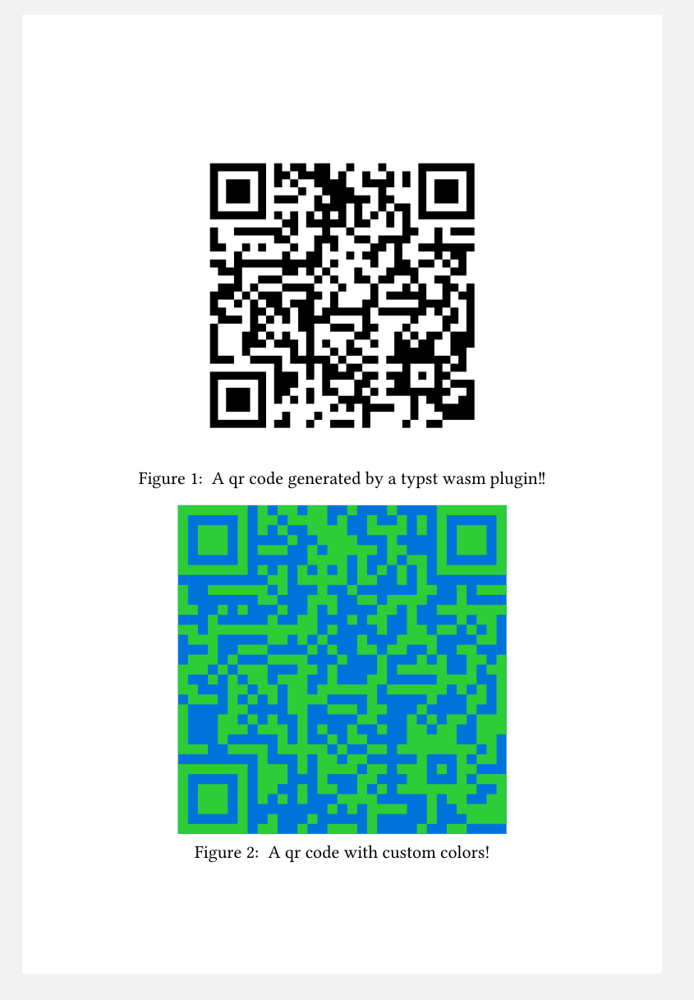

# Typst-QR

This is a [`typst`](https://github.com/typst/typst) WASM plugin for generating QR code:

The plugin is implemented in Rust and is only a thin wrapper around
[`qrcode-rs`](https://crates.io/crates/qrcode-rs). It does not much more than
exposing the relevant customization options to `typst` and handle the serialization of the
arguments between WASM and `typst`. The resulting QR code is passed back to `typst` as a svg string,
which is then rendered as an image.

The plugin can be compiling using `cargo b --release`.
The `typst` file can be compiled using `typst c example.typ`.

> ℹ️ WASM plugins haven't landed in a released version of the `typst` compiler yet. So currently this requires a self compiled version from the master branch!

```typst
#set page(width: auto, height: auto)
#let typst_qr = plugin("target/wasm32-unknown-unknown/release/typst_qr.wasm")

#let qr(data, dark_color: black, light_color: white, has_quiet_zone: true, width: auto) = image.decode(
    str(typst_qr.qr(
        bytes(data),
        bytes(dark_color.hex()),
        bytes(light_color.hex()),
        bytes((int(has_quiet_zone),))
    )),
    format: "svg",
    width: width
)

#figure(
    qr("This QR code was generated dynamically by a typst plugin!", width: 200pt),
    caption: [
        A qr code generated by a typst wasm plugin!!
    ],
)

#figure(
    qr(
        "This QR code was generated dynamically by a typst plugin!",
        dark_color: green,
        light_color: blue,
        has_quiet_zone: false,
        width: 200pt
    ),
    caption: [
        A qr code with custom colors!
    ],
)
```
